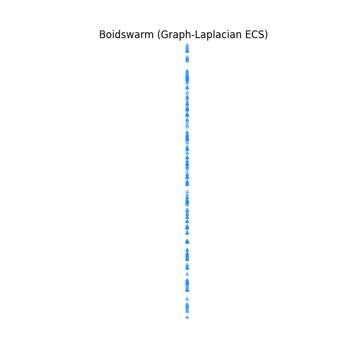

# Boidswarm (zombiebubble-boids)

An advanced, high-performance Entity Component System (ECS) flocking simulation. 

While traditional "Boids" algorithms simulate flocking using 3 basic rules (separation, alignment, cohesion), `boidswarm` introduces an advanced **Graph-Laplacian Leader Election** system. This allows your flock to intelligently pass messages, nominate leaders, and gracefully recover when leaders get stuck or destroyed.

## Installation

```bash
pip install boidswarm
```

## Features (No Advanced Math Required!)



If you've never used Boids before, think of them as AI agents that group together like flocks of birds or schools of fish. This library makes managing them incredibly robust:

### 1. The "Ripple Effect" (Signal Propagation)
In basic flocking, a boid only reacts to its immediate neighbors. If a boid at the front spots the player or a target, the back of the flock won't know and might break formation.
* **How it works:** Information (like a "pursuit signal") diffuses through the flock like heat spreading through metal.
* **How to use it:** You control this with the `alpha` parameter. 
  * `alpha = 0.1` to `0.3`: Highly recommended. The signal spreads fluidly and realistically.
  * `alpha = 0.0`: No spreading (traditional, dumb boids).
  * `alpha = 1.0`: Instant hive-mind transmission.

### 2. Auto-Healing Leader Election
Navigating complex environments usually causes flocks to get stuck in corners.
* **How it works:** Beneath the hood, the system dynamically classifies every boid into 7 roles (e.g., Follower, Sub-Leader, Leader, Prime). 
* **How to use it:** It works automatically! If your current leader drops out of the simulation (becomes a "Phantom Dead") or its speed drops too low (becomes "Phantom Stuck"), the system immediately promotes a Sub-Leader to take its place. The flock never permanently breaks down.

### 3. Customizable Flock Personalities (Gram Matrix)
You can tune the underlying scoring engine to fit the specific needs of your game or simulation without rewriting any core logic:
* **Resilience-First:** Best for massive, chaotic, or combat-heavy flocks. It guarantees the flock stays together even if multiple leaders are lost simultaneously.
* **Expressiveness-First:** Best for small, tight-knit flocks where you want highly nuanced, synchronized, and agile movements.

## Command Line Usage

Once installed, you can test the simulation via the CLI:
```bash
zombiebubble
```

### Understanding the Console Output

When you run `zombiebubble`, it will simulate a flock of boids and print its metrics to your console. Here's what those numbers mean:

* **step / time:** The current simulation frame and simulated time elapsed.
* **spread:** How far apart the boids are spread out (in meters). A shrinking spread means the flock is gathering together (Cohesion).
* **avg speed:** The average speed of the boids.
* **status:** A quick text summary of what the flock is currently doing (e.g., "gathering", "compact flock").

At the end of the run, the tool looks at the initial vs. final spread. If the final spread is smaller, it mathematically confirms that the "Cohesion" rule successfully pulled the flock together.

## License
Licensed under GPL-3.0-only.